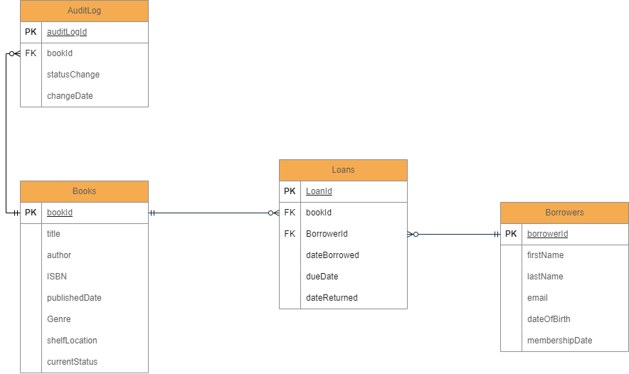

# Library Management System: Database Project

## Background

A local library is transitioning from traditional book-keeping to a digital system. The aim is to efficiently track books, borrowers, loans, returns, and provide insights into borrowing trends.

## Objective

Design and implement a relational database using MS SQL to support the library's operations and enhance querying capabilities.

## Requirements

### 1. Design an Entity Relationship Model (ERM) Diagram

- **Entities**: Books, Borrowers, and Loans.
- **Attributes**: Specify attributes for each entity.
- **Relationships**: Show connections between entities.
- **Connectivity and Cardinality**: Indicate relationship types.
- **Keys**: Identify primary (PK).
- **Tools**: Use ERDPlus, Lucidchart, or similar. 

### 2. Design the Relational Schema using MS SQL

- **Books**:
  - BookID (PK)
  - Title
  - Author
  - ISBN
  - Published Date
  - Genre
  - Shelf Location
  - Current Status ('Available' or 'Borrowed')

- **Borrowers**:
  - BorrowerID (PK)
  - First Name
  - Last Name
  - Email
  - Date of Birth
  - Membership Date

- **Loans**:
  - LoanID (PK)
  - BookID (FK)
  - BorrowerID (FK)
  - Date Borrowed
  - Due Date
  - Date Returned (NULL if not returned yet)

### 3. Build and Seed the Database

- Construct the database in MS SQL.
- Seed with 1000 books, 1000 borrowers, and 1000 loans. Include DML scripts for seeding in the repository.

### 4. Complex Queries and Procedures

- **List of Borrowed Books**: Query to retrieve all borrowed books for a specific borrower.
- **Active Borrowers with CTEs**: Identify borrowers with 2+ borrowed books not yet returned.
- **Borrowing Frequency using Window Functions**: Rank borrowers based on frequency.
- **Popular Genre Analysis**: Determine the most popular genre per month.
- **Stored Procedure - `sp_AddNewBorrower`**: Add a new borrower; handle existing emails.
- **Database Function - `fn_CalculateOverdueFees`**: Compute overdue fees for loans.
- **Database Function - `fn_BookBorrowingFrequency`**: Count how many times a book has been borrowed.
- **Overdue Analysis**: List overdue books with associated borrowers.
- **Author Popularity using Aggregation**: Rank authors by borrowing frequency.
- **Genre Preference by Age**: Determine genre preference across age groups.
- **Stored Procedure - `sp_BorrowedBooksReport`**: Generate a report of books borrowed within a date range.
- **Trigger Implementation**: Log changes in book status to an `AuditLog`.

### BONUS

- **Weekly Peak Days**: Identify the three busiest days of the week for loans and express as a percentage of total loans.
